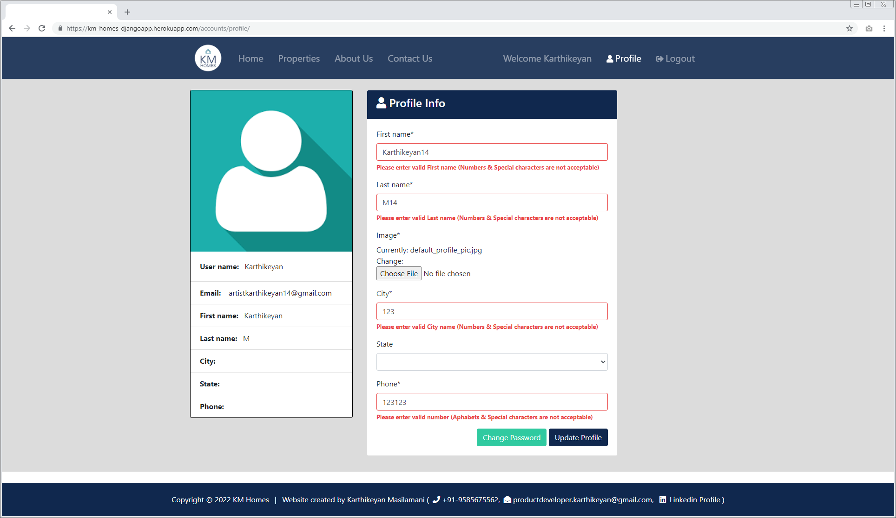

### Project:
* **KM-Homes** - Aim of this application is to serve Seller, Buyer, Realtor in most efficient way.
---
### Project Description:
* **KM-Homes** - Aim of this application is to serve Seller, Buyer, Realtor in most efficient way.
---
<!-- ###Motivation:
* One of my friend asked me to create Realestate application for his Business.
--- -->
### Structure & Design Principle:

---
### Frameworks & Applications used:
* Django, Bootstrap, HTML, CSS, JS, Heroku, Postgresql
---
### Featured Pages:
* **Register** - Helps User to Create his/her account.
* **Login** - Helps User to login his/her account.
* **Home** - Consists of Search & Latest Property details.
* **Properties** - Shows List of properties for sale.
* **About Us** - Shows Company policies & Team details.
* **Contact Us** - It helps Sellers to communicate with KM-Homes Teams.
* **Dashboard** - Shows Inquired Porperty details of User.
* **Profile** - Helps User to maintain his/her profile details.
* **Logout** - Helps User to logout from his/her account.
---
### Register - page:
* Helps User to Create his/her account.

 

* Each & Every fields have its own validaition functionality.

* Successful Registration navigates User to Login page.

---
### Login - page:
* Helps User to login his/her account.

 

* Both fields have its own validaition check.

* Successful Login navigates User to Dashboard page.

---
### Home - page:
* Consists of Search & Latest Property details.

* Search form helps to render Properties based on search parameters.

* If none of the search criteria is mentioned, then Search form will render all Properties listed in our website.

---
### Properties - page:
* Shows List of properties for sale.

* User can view interested property details by clicking "More info".

* If User is interested in property, then he/she can raise Inquiry by clicking "Make an Inquiry".

* If User made successful inquiry then he/she will recieve Confirmation mail from KM-Home team.

* Similarly, property's realtor will get notification mail from KM-Home team.

* If User made successful inquiry then he/she will get Success message notification.

* Similarly, successfully inquired property will get added to Dashboard page.

* Else, If User tries to raise multiple inquiry for same property then he/she will get Error message notification.

---
### About Us - page:
* Shows Company policies & Team details.

---
### Contact Us - page:
* It helps Sellers to communicate with KM-Homes Teams.

* Requester will get notification mail from KM-Homes Teams. 

* If request is raised successfully, he/she will get redirected to home page.

* Else, If requester mentioned any invalid parameters, then he/she will get validation message.

---

### Dashboard - page:
* It help to keeps track of inquires which are made by users.

---
### Profile - page:
* Helps User to maintain his/her profile details. 

* If User tries to update valid profile information, then he/she will get success notification. 

* Else, User will get validation error message for respective fields.

---
### Logout - page:
* Helps User to logout from his/her account & get navigated to Home page with success message.

---

## Extra Features:

* Passwrod reset
* Change password
* Authorised user only have access to Dashboard/Property/Profile page

---

### Password reset:
* Helps User to reset his/her password. click "Forgot password?" from login page.

* User should enter his/her registered email address.

* It will send "Reset Password" link to registered email address.

* It will redirect User to "Password Reset" page.

* Finally, User get success notification for password reset.

---

### Change password:

* Helps User to change his/her password. click "Change Password" from Profile page.

* User should enter Old & New password.

* Finally, It redirect User to Profile page with success message.

---

### Authorised user only have access to Dashboard/Property/Profile page

* After loggout, If user trying to access Dashboard/Property/Profile page. User will get redirected to "Login Page". After successful login User will be redirected to expected page.

* Similarly, above scenario will be applicable for Unauthorized user.

    * https://km-homes-djangoapp.herokuapp.com/accounts/dashboard/
    * https://km-homes-djangoapp.herokuapp.com/listings/7
    * https://km-homes-djangoapp.herokuapp.com/accounts/profile/

* Below I have mentioned only Profile access scenario.

---
### Conclusion:

* If you have read this far I really appreciate it.

* Connect With me at [LinkedIn](https://www.linkedin.com/in/karthikeyan-m-576336240/) & [Github](https://github.com/developer-karthikeyan)

* Do share your valuable opinion, I appreciate your honest feedback!

---
