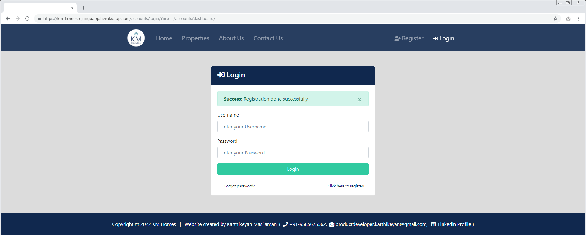
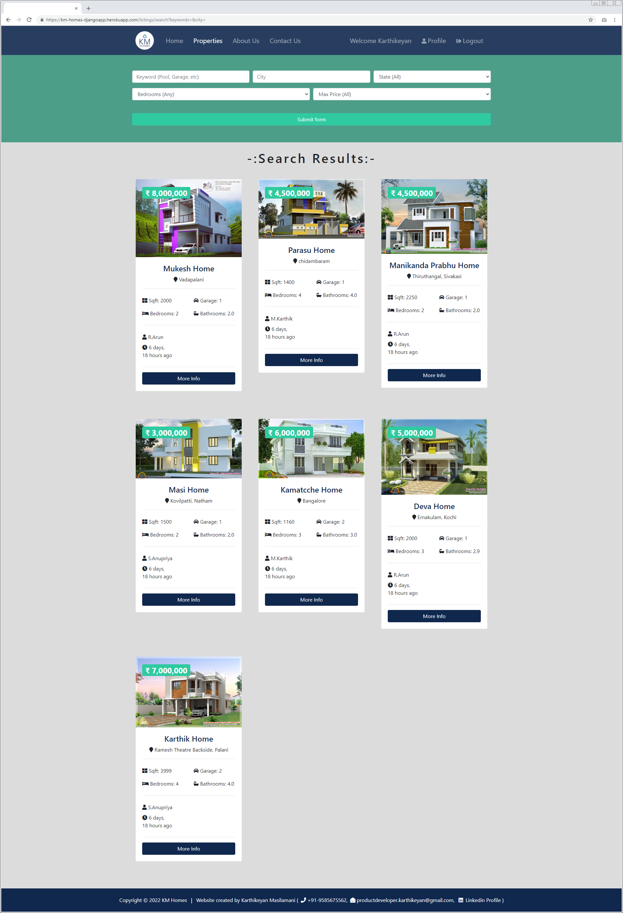
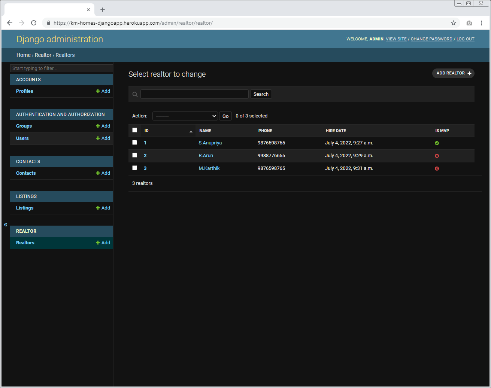

### Project:
* **KM-Homes** - Aim of this application is to connect serve Sellers, Buyers, Realtors in most efficient way.
---
### Project Description:
* Aim of this application is to connect serve Sellers, Buyers, Realtors in most efficient way.
---
### Structure & Design Principle:    

---
### Frameworks & Applications used:
* Django, Bootstrap, HTML, CSS, JS, Heroku, Postgresql
---
### Featured Pages:
* **Register** 
* **Login**
* **Home** 
* **Properties** 
* **About Us** 
* **Contact Us**
* **Dashboard**
* **Profile** 
* **Logout** 
---
### Register page:
* Helps User to Create his/her account.
    
     
  
* If User gave valid parameters then he/she will get Registered & navigated to Login page.
    

    
     

* Else, User will get **validation errors** based on the given parameters.
    
     
---
### Login page:
* Helps User to login his/her account.
    
     

* If User gave valid credentials, then he/she will get Loggedin & get navigated to Dashboard page.
    

    
     

* Else, User will get **validation errors** based on the given parameters.
    
---
### Home page:
* It Consists of Search feature & Latest Property details.
    
     

* Search feature helps User to find expected Properties from all states in India.
    

    
     

* If none of the search criteria is mentioned by User, then Search feature will shows all the Properties listed in website.
    

    
---
### Properties page:
* It shows complete list of properties for sale.
    
     

* User can view specific property details by clicking **"More info"**.
    
     

* If User is interested in this property, then he/she can raise Inquiry by clicking **"Make an Inquiry"**.
    
     

* If User made successful inquiry, then he/she will recieve Confirmation mail from **KM-Home team**.
    
         
    
     

* Similarly, respective realtor for that property will also get notification mail from **KM-Home team**.
    
         
    
     

* If User made successful inquiry, then he/she will get **Success notification**.
    
     

* Also inquired property will get added to User's Dashboard page.
    
     

* Users are allowed to raise only one inquiry for a property.
* If User tries to raise multiple inquiries, then he/she will get **Error notification**.
    
---
### About Us page:
* It shows Company policies & Realtor team details.
    
---
### Contact Us page:
* Sellers can post their queries to KM-Homes teams through this contact form.
    
    
     

* For every successfully post, Requester will get notification mail from KM-Homes Teams. 
    
         
    
     

* If request is raised successfully, he/she will get redirected to home page.
    
     

* Else, Requester will get **validation errors** based on the given parameters.
    
---
### Dashboard page:
* It helps to keep track of User's inquiry list.
* Newly registered User won't have inquiry list.
    
         
* Existing User's inquiries are listed in Dashboard.    
    
---
### Profile page:
* It helps User to maintain his/her profile details. 
    
     

* If User provided valid parameters. Those details got updated & he/she will get **Success notification**. 
    
     

* Else, User will get **validation errors** based on the given parameters.
    
---
### Logout page:
* It helps User to logout from his/her account & get navigated to **Home page** with **Success message**.
    
    
---
## Extra Features:

* Password reset.
* Change password.
* Preventing Dashboard/Property/Profile pages from Unauthorized User.
* Administrator's Admin Panel.
---
### Password reset:
* click **"Forgot password?"** from login page.
    
     

* User should enter his/her registered email address.
    
     

* It will send **"Reset Password"** link to registered email address.
    
    
     
    
     

* After clicking the link, It will redirect User to **"Password Reset"** page.
    
     

* Once password reset was done. Finally, User get **success notification**. Now, User can able to login with his/her new passsword.
    
---
### Change password:

* click **"Change Password"** from Profile page.
    
     

* User should enter valid **"Old"** & **"New"** password.
    
     

* Once password got changed. Finally, User will get redirected to **"Profile page"** with **success notification**.
    
---
### Preventing Dashboard/Property/Profile pages from Unauthorized User:

* After logout, If user trying to access his/her **Dashboard/Property/Profile** page. User will get automatically redirected to **"Login Page"**. After successful login User will get redirected to expected page.
     

* **Dashboard/Property/Profile** page links for reference:
    * https://km-homes-djangoapp.herokuapp.com/accounts/dashboard/
    * https://km-homes-djangoapp.herokuapp.com/listings/7
    * https://km-homes-djangoapp.herokuapp.com/accounts/profile/
     

* Here, I have mentioned only **Profile page** access scenario. For example, after successful logout User trying to access his/her Profile page.
    
     
* User will get automatically redirected to **"Login Page"**.
    
     
* After successful login, User will be taken to expected **Profile page**.
    
---

### Admin Panel for administration purpose:

* KM Homes website admin page.
    
     
* Administrator has full access to **add/remove Properties** from **Listings** tab.
        
    
     
* Similarly, Administrator has full access to **add/remove Realtor** from **Realtors** tab.
        
    
---

### Future Updates:

* Gmail or Facebook account based **User Signed Up**.
* **Google maps** feature to show exact location of Property.
* **Machine Learning** feature for Property search.
* **Data Analytics** feature to generate reports for Property sale.
---

### Conclusion:

* Thanks for reading this Document. I really appreciate your Patience & Effort.

* Kindly please share your valuable feedback & comments through ( +91-9585675562, productdeveloper.karthikeyan@gmail.com ).

* Connect with me at [LinkedIn](https://www.linkedin.com/in/karthikeyan-m-576336240/) & [Github](https://github.com/developer-karthikeyan).
---