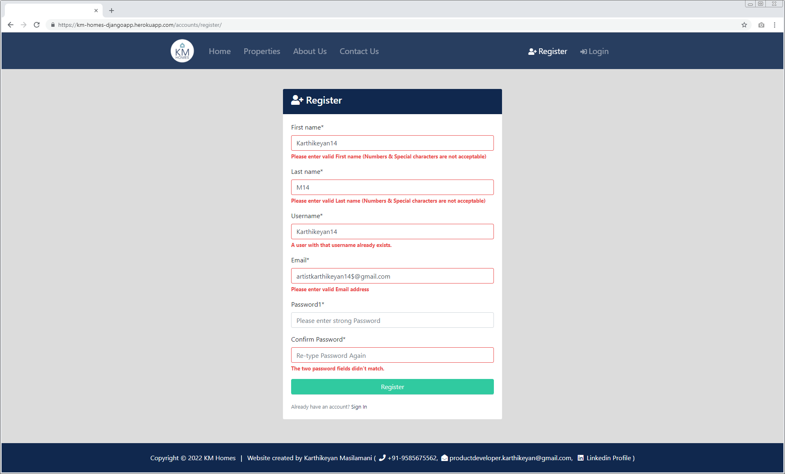

###Project:
* **KM-Homes** - Aim of this application is to serve Seller, Buyer, Realtor in most efficient way.
---
###Project Description:
* **KM-Homes** - Aim of this application is to serve Seller, Buyer, Realtor in most efficient way.
---
<!-- ###Motivation:
* One of my friend asked me to create Realestate application for his Business.
--- -->
### Structure & Design Principle:

---
###Frameworks & Applications used:
* Django, Bootstrap, HTML, CSS, JS, Heroku, Postgresql
---
###Features:
* **Register** - Helps User to Create his/her account.
* **Login** - Helps User to login his/her account.
* **Home** - Consists of Search & Latest Property details.
* **Properties** - Shows List of properties for sale.
* **About Us** - Shows Company policies & Team details.
* **Contact Us** - It helps Sellers to communicate with KM-Homes Teams.
* **Dashboard** - Shows Inquired Porperty details of User.
* **Logout** - Helps User to logout from his/her account.
---
###Register - page:
* Helps User to Create his/her account.

 
* Each & Every fields have its own validaition functionality. 
eg: User should give unique name for Username.

---
###Login - page:
* Helps User to login his/her account.

 
* Both fields have its own validaition functionality. 
eg: If Username or Password is incorrect it throws error.

